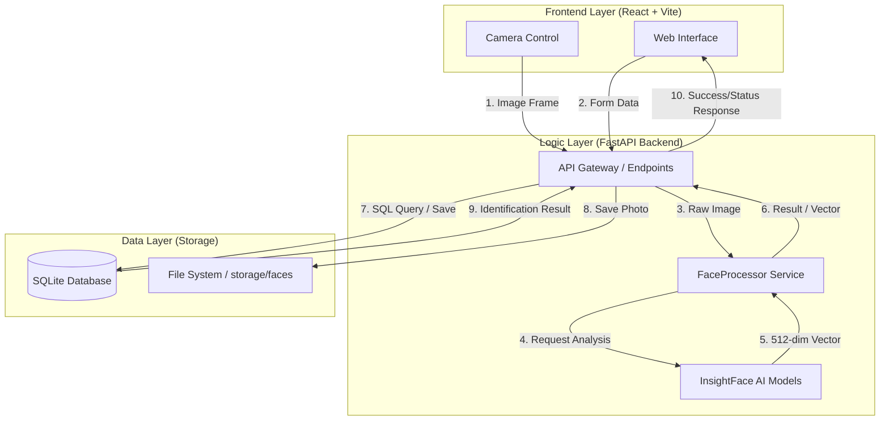
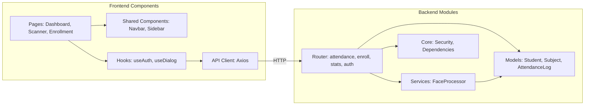
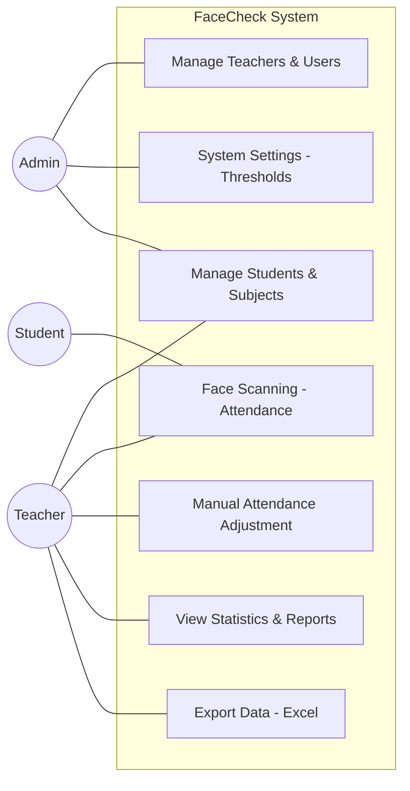
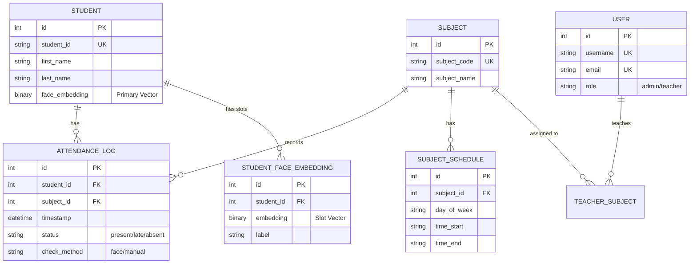

# 🏗️ FaceCheck: System Architecture & Data Flow

เอกสารฉบับนี้อธิบายโครงสร้างการทำงานและเส้นทางการรับ-ส่งข้อมูล (Data Flow) ของระบบ FaceCheck ตั้งแต่ต้นจนจบ เพื่อให้เข้าใจความเชื่อมโยงของแต่ละส่วนประกอบ (Nodes)

---

## 1. แผนภาพภาพรวมระบบ (Overall System Architecture)

ระบบแบ่งออกเป็น 3 ส่วนหลักที่ทำงานประสานกันผ่านโปรโตคอล HTTP (REST API)

---

## 2. โครงสร้างส่วนประกอบซอฟต์แวร์ (Component Diagram)

แสดงการแบ่งโมดูลภายในของทั้ง Frontend และ Backend

---

## 3. แผนผังผู้ใช้งาน (User Use Case Diagram)

แสดงบทบาทและสิทธิ์การเข้าถึงฟีเจอร์ต่างๆ ของผู้ใช้แต่ละกลุ่ม

---

## 4. แผนผังความสัมพันธ์ข้อมูล (Entity Relationship Diagram - ERD)

แสดงโครงสร้างฐานข้อมูลและความเชื่อมโยงของข้อมูลในระบบ

---

## 5. เส้นทางของข้อมูลในกระบวนการหลัก (Core Data Journeys)

### 📸 กระบวนการสแกนเช็คชื่อ (Attendance Scanning Flow)
1.  **[Input]**: Frontend Capture ภาพใบหน้าจากกล้องวิดีโอ
2.  **[AI Processing]**: 
    *   **Detection**: ค้นหาพิกัดใบหน้า
    *   **Liveness**: ตรวจสอบว่าเป็นคนจริง (Anti-spoofing)
    *   **Embedding**: แปลงใบหน้าเป็นชุดตัวเลข (Vector)
3.  **[Matching]**: ระบบนำ Vector ไปคำนวณระยะห่างกับ Vector ใน Database
4.  **[Business Logic]**: เช็คตารางสอนและเวลาเพื่อกำหนดสถานะ (มาเรียน / สาย)
5.  **[Output]**: บันทึกลงตาราง `AttendanceLog` และส่งผลลัพธ์กลับไปยัง UI

---

## 6. ความปลอดภัยของข้อมูล (Data Security)

*   **Identity Protection**: ระบบเก็บข้อมูลใบหน้าในรูปแบบ **Vector (Numerical Data)** ซึ่งยากต่อการย้อนกลับไปเป็นรูปภาพต้นฉบับได้
*   **Authentication**: การเข้าถึง API ถูกปกป้องด้วย **JWT Token** (JSON Web Token) เพื่อระบุตัวตนและสิทธิ์ของผู้ใช้งาน (Role-based Access Control)
