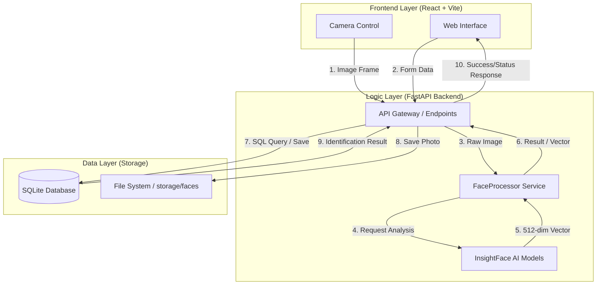

# 🏗️ FaceCheck: System Architecture & Data Flow

เอกสารฉบับนี้อธิบายโครงสร้างการทำงานและเส้นทางการรับ-ส่งข้อมูล (Data Flow) ของระบบ FaceCheck ตั้งแต่ต้นจนจบ เพื่อให้เข้าใจความเชื่อมโยงของแต่ละส่วนประกอบ (Nodes)

---

## 1. แผนภาพภาพรวมระบบ (Overall System Architecture)

ระบบแบ่งออกเป็น 3 ส่วนหลักที่ทำงานประสานกันผ่านโปรโตคอล HTTP (REST API)

---

## 2. เส้นทางของข้อมูลในกระบวนการหลัก (Core Data Journeys)

### 📸 กระบวนการสแกนเช็คชื่อ (Attendance Scanning Flow)
เมื่อนักศึกษามายืนหน้ากล้อง ข้อมูลจะเดินทางดังนี้:

1.  **[Input Node]**: Frontend Capture ภาพใบหน้าจากกล้องวิดีโอ
2.  **[Transmission Node]**: ส่งภาพผ่าน HTTP POST ไปยัง `/attendance/scan`
3.  **[AI Processing Node]**: 
    *   **Detection**: ค้นหาพิกัดใบหน้า
    *   **Liveness**: ตรวจสอบว่าเป็นคนจริง (ไม่ใช่รูปถ่าย/หน้าจอ)
    *   **Embedding**: แปลงใบหน้าเป็นชุดตัวเลข (Vector)
4.  **[Matching Node]**: ระบบนำ Vector จากกล้องไปคำนวณระยะห่าง (Euclidean Distance) กับ Vector ทั้งหมดใน Database
5.  **[Business Logic Node]**: เมื่อพบเจ้าของใบหน้า ระบบเช็คตารางสอนและเวลาปัจจุบันเพื่อกำหนดสถานะ (มาเรียน / สาย)
6.  **[Output Node]**: บันทึกลงตาราง `AttendanceLog` และส่งชื่อนักศึกษากลับไปแสดงผลที่หน้าจอ

---

### 📝 กระบวนการลงทะเบียนนักศึกษาใหม่ (Student Enrollment Flow)
ขั้นตอนการสร้าง "ตัวตน" ให้กับนักศึกษาในระบบ:

1.  **Admin Input**: กรอกประวัติและอัปโหลดรูปถ่ายหน้าตรง
2.  **Processing**: AI สกัดเอา "ลักษณะเด่น" ของใบหน้าออกมาเป็น Vector
3.  **Storage**: 
    *   เก็บ **ข้อมูลประวัติ + Vector** ไว้ในฐานข้อมูล (เพื่อใช้ค้นหา)
    *   เก็บ **รูปภาพต้นฉบับ** ไว้ในระบบไฟล์ (เพื่อใช้ยืนยันด้วยตาเปล่า)

---

## 3. รายละเอียดหน้าที่ของแต่ละ Node (Node Responsibilities)

| Node | หน้าที่หลัก | เทคโนโลยีที่ใช้ |
| :--- | :--- | :--- |
| **Frontend UI** | แสดงผลหน้าจอ, รับอินพุตจากผู้ใช้, จัดการกล้อง | React, Vite |
| **API Endpoint** | รับคำขอจากหน้าเว็บ, ตรวจสอบสิทธิ์ (Auth), สั่งการ Logic | FastAPI, SQLAlchemy |
| **FaceProcessor** | ควบคุมลำดับการทำงานของ AI (Detect -> Check -> Embed) | Python, OpenCV |
| **AI Models** | วิเคราะห์ภาพใบหน้าและแปลงเป็นรหัสคณิตศาสตร์ | InsightFace, ONNX Runtime |
| **Database** | เก็บข้อมูล Metadata, ตารางเวลา และ Face Vectors | SQLite |
| **FileSystem** | จัดเก็บไฟล์รูปภาพ JPG เพื่อใช้เป็นหลักฐาน | Local Storage |

---

## 4. ความปลอดภัยของข้อมูล (Data Security)

*   **Identity Protection**: ระบบไม่ได้เก็บ "รหัสผ่านใบหน้า" ในรูปแบบรูปภาพอย่างเดียว แต่เก็บเป็น **Vector (Numerical Data)** ซึ่งยากต่อการย้อนกลับไปเป็นรูปภาพต้นฉบับได้โดยตรง
*   **Authentication**: การส่งข้อมูลระหว่าง Frontend และ Backend ถูกปกป้องด้วย **JWT Token** เพื่อให้มั่นใจว่าเฉพาะผู้ที่มีสิทธิ์เท่านั้นที่สามารถเข้าถึงข้อมูลหรือจัดการระบบได้
