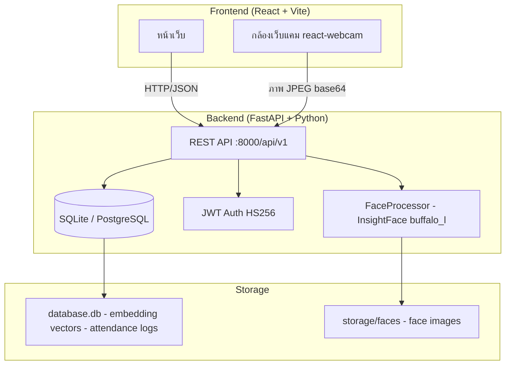
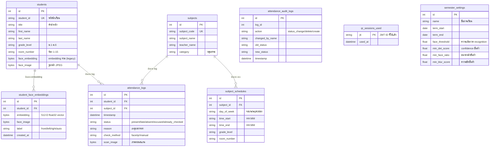
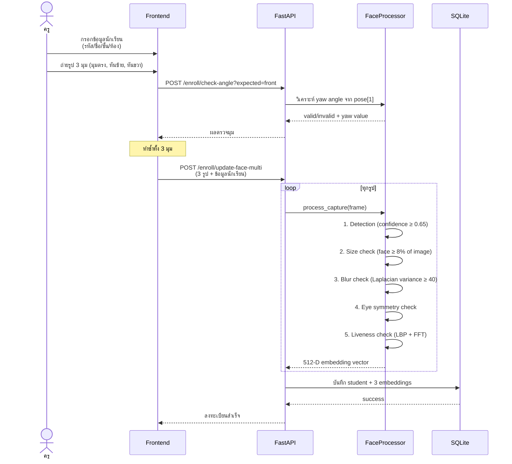
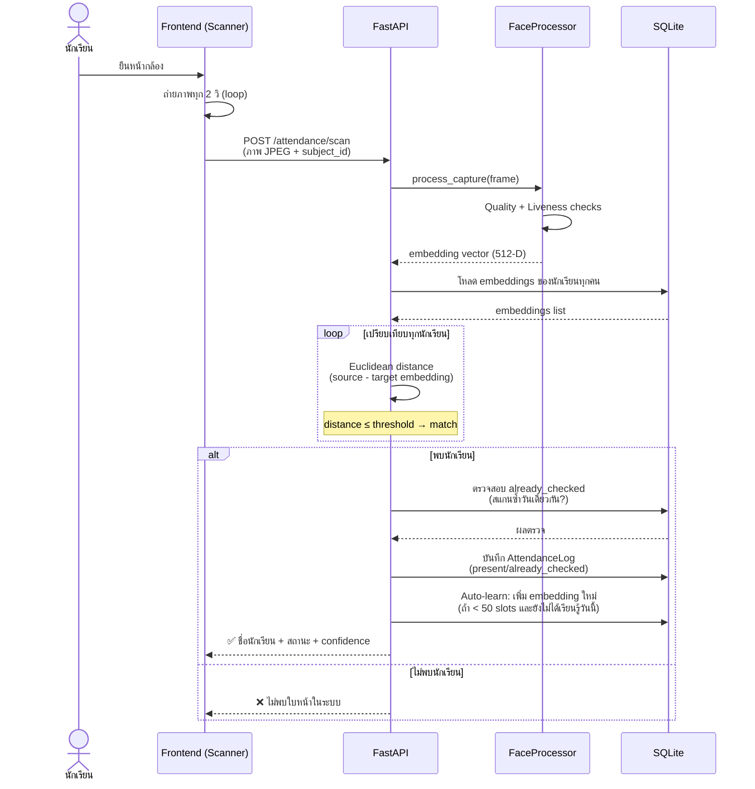
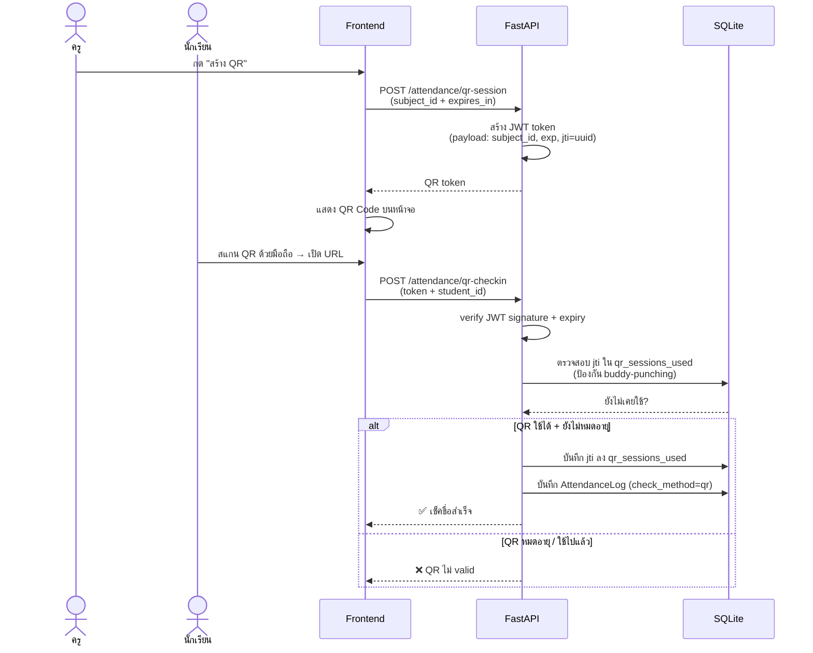
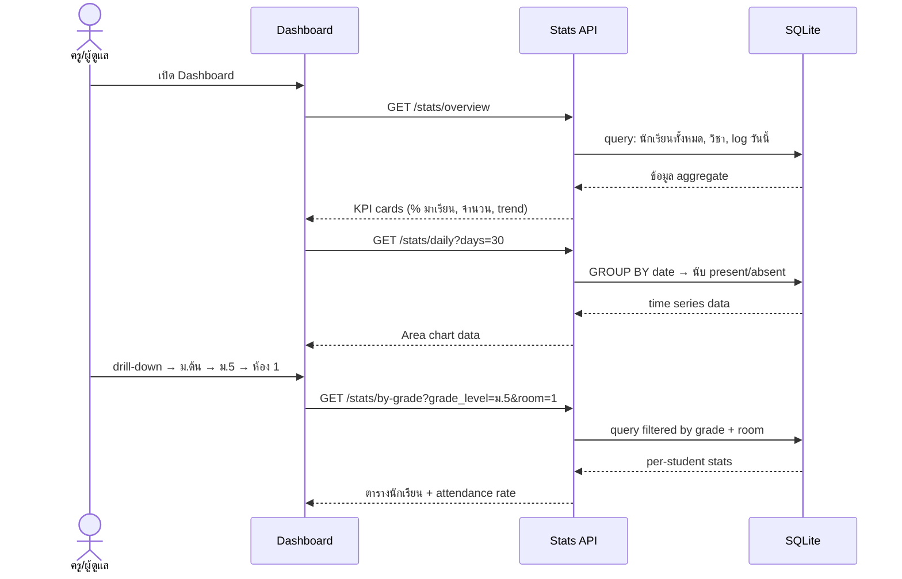

# FaceCheck — ระบบเช็คชื่อด้วยใบหน้า
## เอกสารสรุปการทำงานของระบบ

---

## 1. ภาพรวมระบบ

FaceCheck คือระบบบันทึกการเข้าเรียนอัตโนมัติสำหรับโรงเรียน รองรับการเช็คชื่อ 3 วิธี ได้แก่ **สแกนใบหน้า**, **สแกน QR Code**, และ **กรอกมือ** ระบบออกแบบมาเพื่อใช้งานบนเครื่องภายใน (on-premise) ไม่ต้องส่งข้อมูลชีวมิติออกนอกโรงเรียน

---

## 2. สถาปัตยกรรมระบบ (System Architecture)



### การไหลของข้อมูลหลัก

```
Browser ──HTTPS──► FastAPI ──► FaceProcessor (InsightFace)
                      │              │
                      ▼              ▼
                   SQLite       Face Embedding (512-D vector)
                      │
                      ▼
                React Dashboard ◄── Stats API ◄── SQLAlchemy ORM
```

---

## 3. เทคโนโลยีที่ใช้

### Backend

| เทคโนโลยี | เวอร์ชัน | ใช้ทำอะไร | ทำไมเลือก |
|-----------|---------|----------|-----------|
| **Python** | 3.10+ | ภาษาหลัก | ecosystem AI/ML ดีที่สุด |
| **FastAPI** | latest | REST API framework | async, auto docs (Swagger), validation ด้วย Pydantic |
| **InsightFace** | 0.7+ | Face detection + recognition | accuracy สูง, ฟรี, รัน CPU ได้ |
| **buffalo_l** | — | โมเดล AI ใบหน้า | balance ระหว่าง accuracy กับ speed |
| **OpenCV** | 4.x | ประมวลผลภาพ | blur detection, liveness check |
| **SQLite** | built-in | ฐานข้อมูล (local) | ไม่ต้องติดตั้งเพิ่ม, เพียงพอสำหรับ 1 โรงเรียน |
| **SQLAlchemy** | 2.x | ORM | type-safe, รองรับ SQLite และ PostgreSQL |
| **JWT (python-jose)** | — | Authentication | stateless, ปลอดภัย |
| **openpyxl** | — | สร้างไฟล์ Excel | export รายงาน |

### Frontend

| เทคโนโลยี | เวอร์ชัน | ใช้ทำอะไร | ทำไมเลือก |
|-----------|---------|----------|-----------|
| **React** | 18 | UI framework | component-based, state management ง่าย |
| **Vite** | 5 | Build tool | build เร็ว, HMR instant |
| **Tailwind CSS** | v4 | CSS utility | เขียน CSS เร็ว ไม่ต้องตั้งชื่อ class |
| **Recharts** | — | กราฟ/chart | declarative, React-native |
| **react-webcam** | — | เข้าถึงกล้อง | wrapper `getUserMedia` ง่าย |
| **axios** | — | HTTP client | interceptors, error handling ดี |
| **react-router-dom** | v6 | SPA routing | standard React routing |

---

## 4. โครงสร้างฐานข้อมูล (Database Schema)



---

## 5. กระบวนการทำงานหลัก (Data Flow)

### 5.1 ลงทะเบียนใบหน้า (Face Enrollment)



### 5.2 สแกนใบหน้าเช็คชื่อ (Face Attendance Scan)



### 5.3 เช็คชื่อด้วย QR Code



### 5.4 ดูผลและ Dashboard



---

## 6. อัลกอริทึมสำคัญ

### 6.1 Face Recognition Pipeline

ทุกครั้งที่รับภาพ ระบบทำตามขั้นตอนนี้:

```
ภาพ JPEG
    │
    ▼
[1] InsightFace Detection
    • ตรวจหาใบหน้าในภาพ (SCRFD detector)
    • เลือกใบหน้าใหญ่ที่สุด (กรณีหลายคน)
    │
    ▼
[2] Quality Check (ป้องกันภาพไม่ดี)
    • det_score ≥ 0.65      → confidence ของ AI
    • face area ≥ 8%        → ไม่ใกล้เกินไป
    • ไม่ชิดขอบภาพ (margin 3%)
    • ตาสองข้างสมมาตร (eye_y_diff/eye_dist ≤ 25%)
    • blur score ≥ 40       → Laplacian variance
    │
    ▼
[3] Liveness Check (ป้องกันใช้รูปภาพโกง)
    • LBP variance: ผิวจริงมี micro-texture ซับซ้อน
    • FFT analysis: หน้าจอสร้าง periodic frequency
    • บล็อกเมื่อ: LBP var < 40 AND FFT peak ratio > 20
    │
    ▼
[4] ArcFace Embedding
    • สร้าง vector 512 มิติ (float32)
    • normalize แล้ว (normed_embedding)
    │
    ▼
[5] Matching (ตอนสแกน)
    • Euclidean distance กับทุก embedding ในระบบ
    • distance = ||embedding_A - embedding_B||₂
    • ผ่านถ้า distance ≤ threshold (default 1.0)
    • เลือกผลที่ distance น้อยที่สุด
```

### 6.2 Multi-Angle Enrollment

ลงทะเบียน 3 มุมเพื่อเพิ่มความแม่นยำตอนสแกน:

| มุม | Yaw angle | ประโยชน์ |
|-----|-----------|---------|
| มุมตรง (front) | \|yaw\| ≤ 15° | baseline |
| หันซ้าย (left) | -50° ≤ yaw ≤ -15° | รู้จักเมื่อยืนเอียง |
| หันขวา (right) | 15° ≤ yaw ≤ 50° | รู้จักเมื่อยืนเอียง |

### 6.3 Auto-Learn

เมื่อสแกนสำเร็จ ระบบ **เรียนรู้ใบหน้าใหม่อัตโนมัติ** เพื่อรับมือกับการเปลี่ยนแปลง (ผมยาวขึ้น, แว่นตา, แสง):
- เพิ่ม embedding ใหม่เข้า `student_face_embeddings` (สูงสุด 50 slots)
- เรียนรู้ได้ **1 ครั้งต่อวันต่อนักเรียน** เท่านั้น
- ทำให้ระบบแม่นยำขึ้นเมื่อใช้งานนานขึ้น

### 6.4 QR Anti-Buddy-Punching

ป้องกันนักเรียนใช้ QR แทนกัน:
1. QR token = JWT มี `jti` (JWT ID = UUID unique)
2. เมื่อใช้ครั้งแรก → บันทึก `jti` ลง `qr_sessions_used`
3. ครั้งต่อไปใช้ QR เดิม → ตรวจพบ jti ซ้ำ → ปฏิเสธ
4. 1 QR = ใช้ได้ 1 ครั้งเท่านั้น

---

## 7. API Endpoints สรุป

| กลุ่ม | Endpoint | Method | ทำอะไร |
|-------|----------|--------|--------|
| **Auth** | `/auth/login` | POST | login รับ JWT |
| | `/auth/register` | POST | สร้าง user ใหม่ (admin) |
| | `/auth/users` | GET | ดูรายชื่อ users |
| | `/auth/me/subjects` | GET | วิชาที่ครูสอน |
| **Enrollment** | `/enroll/students` | GET/POST | จัดการนักเรียน |
| | `/enroll/students/import` | POST | import Excel |
| | `/enroll/update-face-multi` | POST | ลงทะเบียนหน้า 3 มุม |
| | `/enroll/check-angle` | POST | ตรวจมุมหน้า real-time |
| | `/enroll/students/export` | GET | export Excel |
| **Attendance** | `/attendance/scan` | POST | สแกนใบหน้าเช็คชื่อ |
| | `/attendance/qr-session` | POST | สร้าง QR token |
| | `/attendance/qr-checkin` | POST | เช็คชื่อด้วย QR |
| | `/attendance/logs` | GET | ดู log ตามวัน/วิชา |
| | `/attendance/logs/{id}` | PATCH/DELETE | แก้ไข/ลบ log |
| | `/attendance/subjects` | GET/POST | จัดการวิชา |
| **Stats** | `/stats/overview` | GET | KPI ภาพรวมโรงเรียน |
| | `/stats/daily` | GET | ข้อมูล time series 30 วัน |
| | `/stats/by-grade` | GET | สถิติแยกตามชั้น/ห้อง |
| | `/stats/subject-attendance` | GET | gradebook ต่อวิชา |
| | `/stats/student/{id}` | GET | ข้อมูลนักเรียนรายบุคคล |
| **Reports** | `/reports/export` | GET | export Excel รายงาน |
| **Settings** | `/settings/semester` | GET/PUT | ตั้งค่าภาคเรียน + threshold |
| **Audit** | `/audit/logs` | GET | ประวัติการแก้ไขข้อมูล |

---

## 8. ความปลอดภัย (Security)

| จุด | กลไก | รายละเอียด |
|-----|------|-----------|
| **Authentication** | JWT HS256 | token มีอายุ, เก็บใน localStorage |
| **Authorization** | Role-based | `admin` และ `teacher` มีสิทธิ์ต่างกัน |
| **Data Scope** | Backend + Frontend filter | `teacher` เห็นเฉพาะนักเรียนในห้องที่ตัวเองสอน (API list) และประวัติสแกนเฉพาะวิชาตัวเอง (frontend filter) — `admin` เห็นทุกข้อมูล พร้อม subject_code/subject_name/teacher_name |
| **Scan Room Lock** | Backend enforce | scan endpoint ตรวจ grade/room ของนักเรียนที่จำได้ vs ตารางสอนของวิชา — ปฏิเสธถ้าไม่ตรง แม้ไม่มี schedule_id (no period lock) |
| **QR โกง** | JTI tracking | 1 QR token ใช้ได้ 1 ครั้ง |
| **รูปภาพโกง** | Liveness check | LBP texture + FFT analysis ตรวจหน้าจอ/พิมพ์ |
| **ภาพคุณภาพต่ำ** | Quality gate | ปฏิเสธภาพเบลอ/ไกล/เอียงก่อน recognition |
| **SECRET_KEY** | Environment var | โหลดจาก `.env` พร้อม warning ถ้าใช้ default |
| **Audit Trail** | Audit log table | บันทึกทุกการแก้ไข status พร้อม ผู้แก้ไข+เวลา |

---

## 9. ฟีเจอร์ทั้งหมดของระบบ

### สำหรับผู้ดูแลระบบ (Admin)

- จัดการบัญชีครูและผู้ดูแล (เพิ่ม/ระงับ/ลบ)
- จัดการรายวิชา + ตารางสอน (วัน/คาบ/ห้อง)
- มอบหมายวิชาให้ครู
- ตั้งค่าภาคเรียน (วันเริ่ม-สิ้นสุด, ค่า threshold การจดจำหน้า)
- ดู Audit Log การเปลี่ยนแปลงข้อมูล

### สำหรับครู

- **Scanner**: สแกนใบหน้าเช็คชื่อ real-time, สร้าง QR, กรอกมือ
- **รายชื่อนักเรียน**: ค้นหา, กรองชั้น/ห้อง/มีใบหน้า, export Excel
- **Dashboard**: KPI การเข้าเรียน, กราฟ trend 30 วัน (นับนักเรียนไม่ซ้ำ เฉพาะ present/late), drill-down ม.ต้น/ม.ปลาย→ชั้น→ห้อง→รายบุคคล — อัตราเข้าเรียนนับ distinct students ไม่เกิน 100%
- **รายงาน**: ค้นหาตามวันที่/วิชา/ชั้น/ห้อง, export Excel 2 sheet, พิมพ์, Gradebook view
- **แก้ไขสถานะ**: เปลี่ยน present/late/absent/excused พร้อมบันทึกเหตุผล

### สำหรับแอดมิน (ลงทะเบียน)

- **Enrollment**: ลงทะเบียนเดี่ยว (3 มุม) หรือ import Excel จำนวนมาก
- Real-time angle validation ขณะถ่ายรูป
- ล็อกกล้องจนกว่าจะกรอกข้อมูลครบ

---

## 10. การรันระบบ

```
โครงสร้าง:
facecheck/
├── backend/          FastAPI + InsightFace
│   ├── main.py       entry point, :8000
│   ├── .env          SECRET_KEY, DATABASE_URL
│   └── storage/      database.db, faces/
└── frontend/         React + Vite
    └── .env          VITE_API_URL=http://localhost:8000/api/v1
```

```bash
# Backend
cd backend
pip install -r requirements.txt
python main.py          # → http://localhost:8000

# Frontend
cd frontend
npm install
npm run dev             # → http://localhost:5173

# Swagger UI (API docs อัตโนมัติ)
http://localhost:8000/docs
```

---

## 11. ข้อจำกัดและแนวทางพัฒนาต่อ

| ข้อจำกัด | สาเหตุ | แนวทาง |
|---------|--------|--------|
| SQLite concurrent writes | single-file DB | เปลี่ยนเป็น PostgreSQL ถ้า scale |
| รัน CPU เท่านั้น | ไม่ใช้ GPU | เพิ่ม CUDA provider ถ้ามี GPU |
| ไม่มี push notification | ยังไม่ implement | เพิ่ม Line Notify / WebSocket |
| ไม่มี student portal | ยังไม่ implement | เพิ่ม role `student` |
